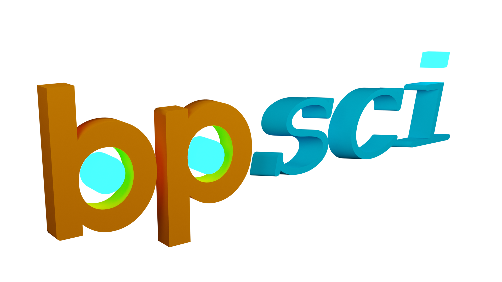

.. bpsci documentation master file, created by
   sphinx-quickstart on Wed Apr 27 18:50:52 2022.
   You can adapt this file completely to your liking, but it should at least
   contain the root `toctree` directive.

Welcome to bpsci!
=================================

bpsci is a Python library for Blender that can be used to create scientific dynamics visualizations. 

To install bpsci and get started with an example, see the :doc:`Quickstart Guide <quickstart>`.
To view the documentation, see the :doc:`documentation <bpsci>`

.. toctree::
   :maxdepth: 2
   :caption: Contents:
   
   quickstart
   bpsci
   

Indices and tables
==================

* :ref:`genindex`
* :ref:`modindex`
* :ref:`search`
